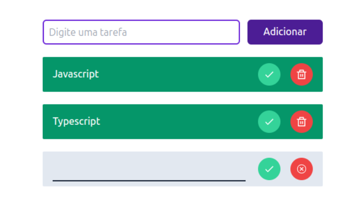

# A initial understanding how to create a Todo List in React

This project is a introduction to help understand how to implement a Todo List fully functional Todo List built in React, using useReducer and useContext hooks. It's still in a early stage, but in the future I plan to implement additional features in this example.
You can create tasks, update their values, mark them as doned and delete them.
